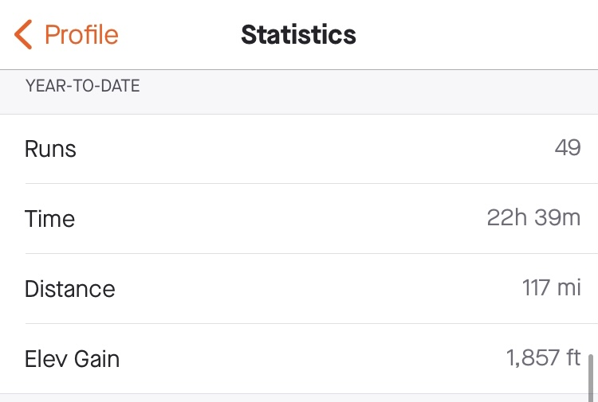

This year was special for me, but the biggest achievement that 
we survived me and my family through this crazy pandemic Alhamdulillah, 
I started the year with the well to focus to become a better man not only to have progress with my career as I usually plan, 
so
- I stared reading more often than I have ever did before and this was really special because some books really changed the way I was living before in way or another.
  I was planning to read 10 books in 2020, but I have read 17 so far.
  

- I focused on my fitness and health as I have learned in [learning how to learn course](https://www.coursera.org/learn/learning-how-to-learn), becoming more fit will help me to perform way better in many aspects in my life beside protecting my brain to dissolve earlie, and anyway I gained a series weight in 2019 
and because of the shut down during the 2020 I started to workout without going to the gym I bought some dumbles and did some bodywight exercises and eventually started to go running since Jun and so far I have ran for 117 miles till now, this really helped me to reduce my body fat from 25 % at the beginning of the year to reach 17 % not so great but it was worth the effort after all :) 
  
  
- Also In my professional life I have left my comfort job at IBM to started new job with new challenges, technical and non-technical,
this beside I have started maintaining a study routine to study the new topics (cloud and serverless) and fundamental concepts like (problem solving).

After all Managed to build and maintain healthy habits and routines during this year, and that's really a life changing win.

### Magical moment
This year was also very special for me emotionally as I have become a father for our youngest family member Nour, witnessing the moment she was born was very special moment for me.
becoming a parent or knowing you will become a parent really changed my perspective for life and what matters and what is not.
### Gratitude
I am really grateful for everything happened to me this year whether it was bad or good,

and most importantly I am grateful for the man who give me this advice when I asked him for a career advice.
> if you become a better man automatically you become a better employee

### 2021

In 2021, I want to do the following

- traveling, enjoying the traveling if it's possible again, please that's enough for the quarantine.
- blogging more often about non-technical stuff.
- maintaining my training & diet and running a complete marathon.
- learning more about AWS and get the AWS cloud practitioner at least.

That's it let's hope for beautiful, calm 2021.
