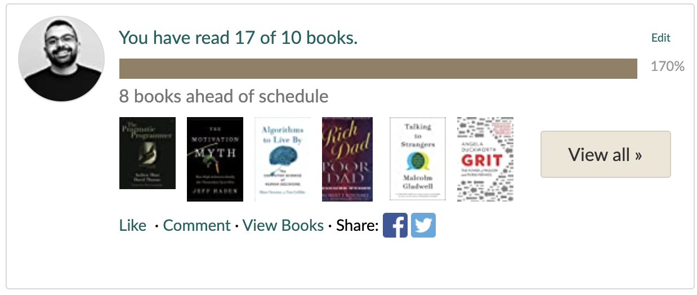
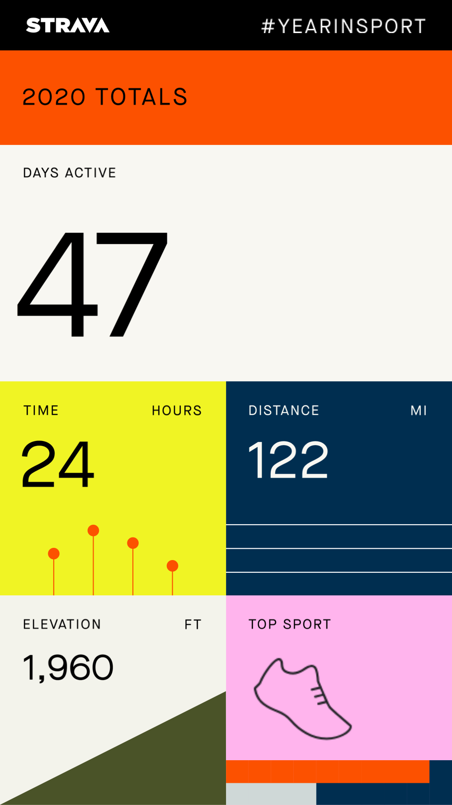

This year was special for me but, still the most blessing thing that happened to me this year is that My family and I survived through this crazy pandemic Alhamdulillah.
I started the year with the will to focus on becoming a better man not only to have progress with my career as I usually plan, but also to improve my personal life and to be happier, healthier and more productive, so I did the following:
- I stared reading more often than I have ever done before and this was really special because some of the books I read books really changed the way I was living before in one way or another.
  I was planning to read 10 books in 2020, but I have read 17 so far.
  
###

- I focused on my fitness and health as I have learned in [learning How To Learn Course](https://www.coursera.org/learn/learning-how-to-learn), That becoming more fit will help me to perform way better in many aspects in my life besides protecting my brain from dissolving earlier, and anyway I gained some series weight in 2019 
and because of the lockdown during the 2020 I started to workout without going to the Gym. 
  I did some bodywight exercises and after that I got some dumbbells and started to lift weights and eventually started to go running since June and so far I have run for 119.9 miles so far, this really helped me to reduce my body fat from 25% at the beginning of the year to reach 17%, not so great but it was worth the effort after all.
  
  
##
- Also, In my professional life I have left my comfort job at IBM to start a new job with new challenges, technical and non-technical,
Addition to that I have started maintaining a study routine to study new topics (cloud and serverless) and fundamental concepts like problem solving.

After all I've managed to build, track and maintain healthy habits and routines during this year, and that's really a life changing win.

## Magical moment
This year was also very special for me emotionally as I have become a father for our youngest family member Nour, witnessing the moment she was born was very special for me.
Becoming a parent or knowing I will become a parent really changed my perspective for life and what matters and what is doesn't.

## Gratitude
I am really grateful for everything that happened to me this year whether it was good or bad,
and most importantly I am grateful for the man who gave me this advice when I asked him for career advice:
### "If you become a better man automatically you become a better employee"
This advice really helped me to change my directions and to think in another way that I haven't thought before.

## 2021

In 2021, I want to do the following

- Traveling, enjoying the trips if it's possible again, please that's enough for the quarantine.
- Blogging more often about non-technical stuff.
- Maintaining my training & diet and running a complete marathon.
- Learn more about AWS and get the AWS cloud practitioner at least.

That's it, Let's hope for beautiful calm 2021.
