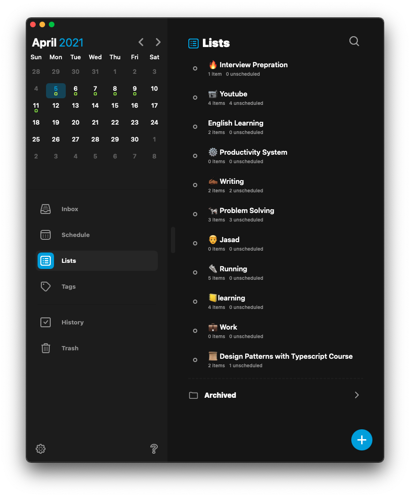
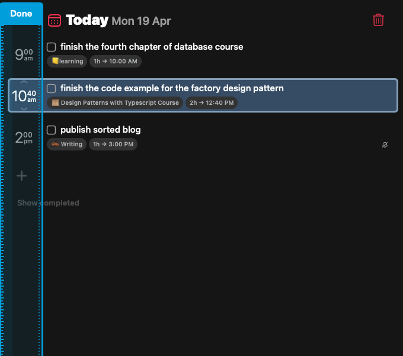

disclaimer: this is not a sponsored blog.
Since I have started using digital todo applications, I was always looking for applications that combine my calendar with my tasks or todos, Because I usually schedule every task as a calendar event during my journey for the last two years I have never found a reliable application. Even though I started thinking about developing one by myself, This until I discovered Sorted3.
Sorted Is one of my favourite productivity apps and here's how I personally use it in order to have a productive week.

### Doing Weekly Planning With Sorted
I am the kind of guy who plans the weeks ahead, and Sorted helps me to do that perfectly. I usually start my week planning session by dumbing all of my ideas into a piece of paper which helps me to have more focus on the ideas and work I want to get done through the week, After that I take all tasks I have wrote down and put it into it's related list in Sorted, and a list is kind of project where you can group some related tasks together.

This is some example of what lists may look like. after adding all tasks to its corresponding list, I edit each task and add estimated duration for it and schedule it to a specific day in the week if the week has enough room for it yet.
That's for the week planning now I have every day in the new week with some tasks on it and each task has estimated duration, now we can move forward to the most interesting part.

### Seamless Scheduling With Auto Schedule Feature
The most helpful and interesting feature in Sorted app is the auto schedule feature. Now since I have each day has various tasks I need to schedule and make time block for each one of them in my calendar so I use Sorted auto schedule feature to that for me however some time I update the schedule a little bit to make sure that the most intensive tasks are getting done in the morning when I have more energy and low intensive tasks are happening in afternoon when I have less energy.
This scheduling helps me a lot to create my daily schedule effortlessly.

### Easily Re-organise your Schedule
The thing about schedule is your day is rarely goes as you planned, sometimes some tasks passed their estimated time or suddenly you have to work on urgent task that is not planned,
So it's important to adjust your schedule as the day goes on, luckily Sorted helps me a lot to do so with the time ruler to adjust tasks or some specific tasks to fit your new schedule.

Also, when I review the tasks that I had during the day to see which one I couldn't finish and if the reason is that the task was underestimated and I have only done one part of it, I can easily reorganise the task to new sub-tasks and only mark the part that i have done.
One more thing really worth mentioning is the best way I found to deal with the leftover tasks is to move them to the next day which is being done automatically by the app.

There are too many todo apps but sorted is one of the unique and effective one I have ever used. I kinda feel it's almost designed to fit my needs. Feel free to check their website from here www.sortedapp.com.
Thank you Sorted team for such a great product <3
